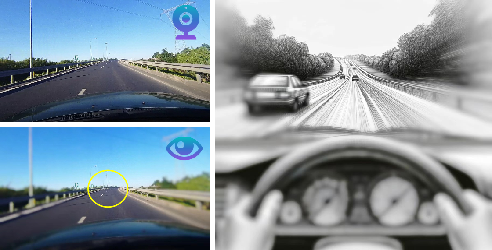
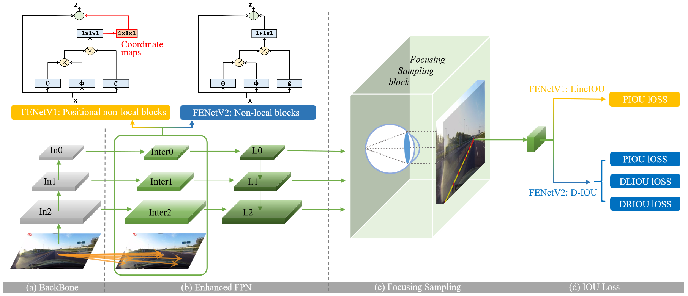
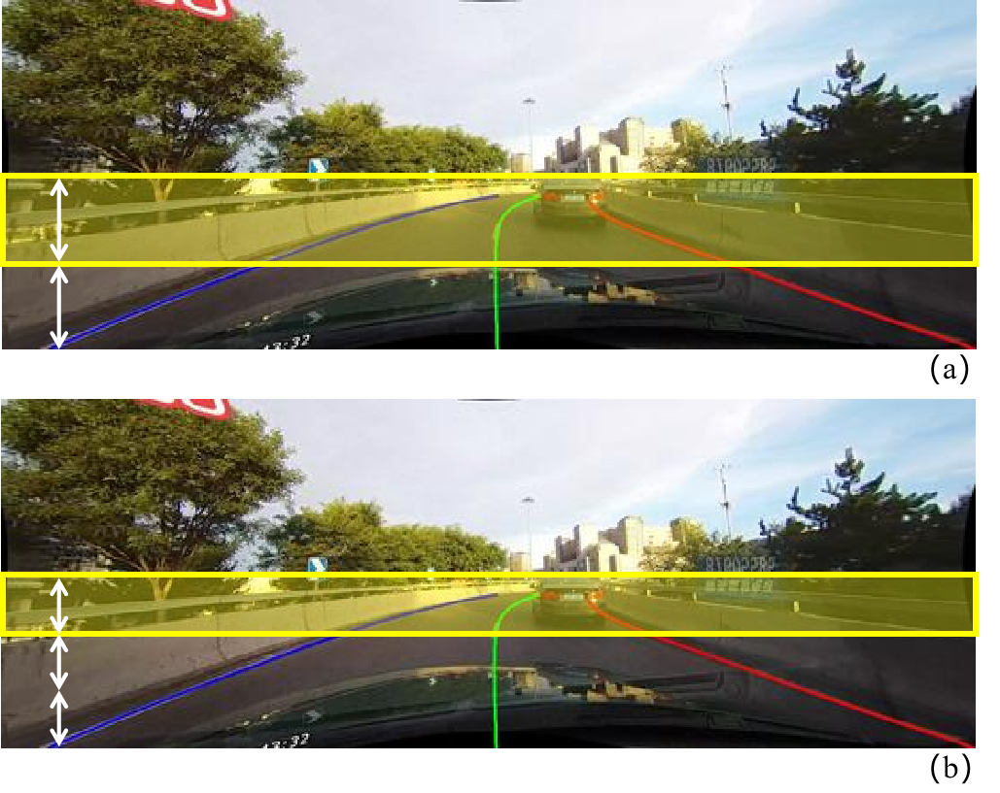
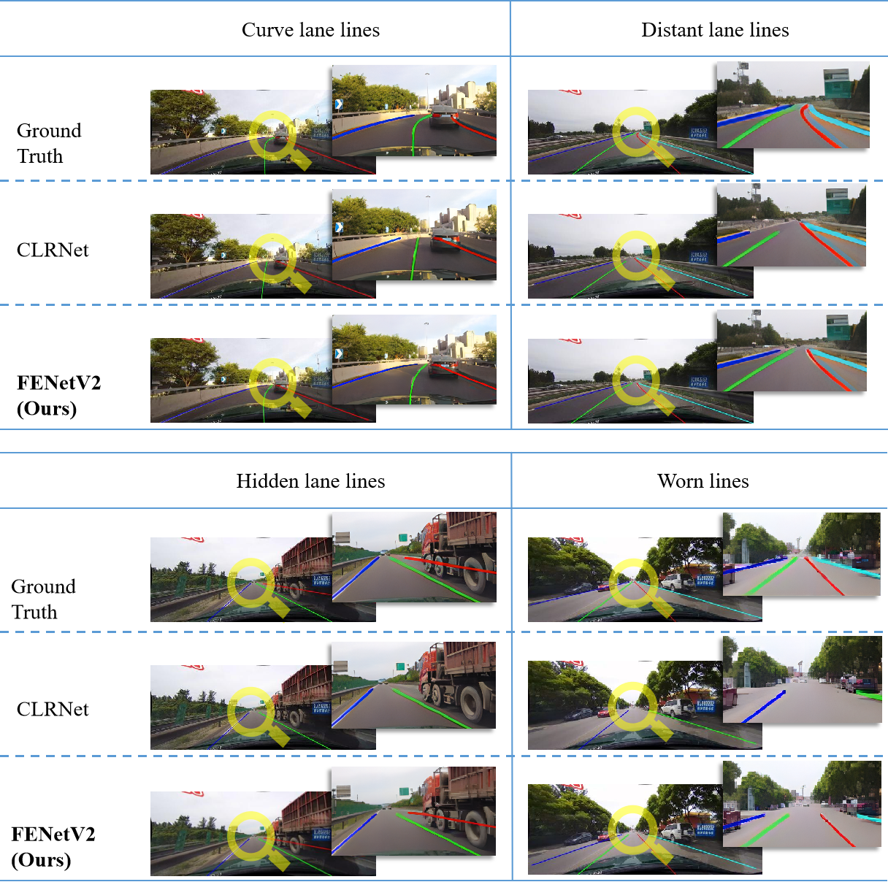

# FENet: Focusing Enhanced Network for Lane Detection

Pytorch implementation of the paper "FENet: Focusing Enhanced Network for Lane Detection" 

The paper is available at [arXiv](https://arxiv.org/abs/2312.17163).

## Introduction
<div align="center">
 
</div>


This research contributes four innovations: 

1. \textbf{Focusing Sampling:} a training strategy prioritizing small and distant lane details
2. \textbf{Partial Field of View Evaluation:} new metrics for accuracy in forward road sections critical for real-world applications
3. \textbf{An enhanced FPN architecture:} that incorporates either positional non-local blocks or standard non-local blocks, depending on the requirement (PEFPN & FEFPN)
4. \textbf{Directional IoU Loss:} a novel regression loss that addresses directional discrepancies in distant lanes


FENetV1, employing positional non-local blocks, achieves state-of-the-art results on conventional metrics by concentrating on perspective-dependent semantics. 

FENetV2, which integrates coordinate modelling into the 'Directional IoU Loss', excels in boundary localization accuracy for distant lanes.

## Installation

### Prerequisites
Only test on Ubuntu18.04 and 20.04 with:
- Python >= 3.8 (tested with Python3.8)
- PyTorch >= 1.11 (tested with Pytorch1.11)
- CUDA (tested with cuda11.3)
- Other dependencies described in `requirements.txt`

### Clone this repository
Clone this code to your workspace. 
We call this directory as `FENET_ROOT`
```Shell
git clone https://github.com/HanyangZhong/FENet.git
```

### Create a conda virtual environment and activate it (conda is optional)

```Shell
conda create -n fenet python=3.8 -y
conda activate fenet
```

### Install dependencies
```Shell
# Install pytorch firstly, the cudatoolkit version should be same in your system.
conda install pytorch torchvision cudatoolkit=11.3 -c pytorch

# Or you can install via pip
pip install torch==1.11.0 torchvision==0.12.0

# Install python packages
python setup.py build develop
```

### Data preparation
#### CULane

Download [CULane](https://xingangpan.github.io/projects/CULane.html). Then extract them to `$CULANEROOT`. Create link to `data` directory.

```Shell
cd CENET_ROOT
mkdir -p data
ln -s $CULANEROOT data/CULane
```

For CULane, you should have structure like this:
```
$CULANEROOT/driver_xx_xxframe    # data folders x6
$CULANEROOT/laneseg_label_w16    # lane segmentation labels
$CULANEROOT/list                 # data lists
```

#### LLAMAS
Dowload [LLAMAS](https://unsupervised-llamas.com/llamas/). Then extract them to `$LLAMASROOT`. Create link to `data` directory.

```Shell
cd $CLRNET_ROOT
mkdir -p data
ln -s $LLAMASROOT data/llamas
```

Unzip both files (`color_images.zip` and `labels.zip`) into the same directory (e.g., `data/llamas/`), which will be the dataset's root. For LLAMAS, you should have structure like this:
```
$LLAMASROOT/color_images/train # data folders
$LLAMASROOT/color_images/test # data folders
$LLAMASROOT/color_images/valid # data folders
$LLAMASROOT/labels/train # labels folders
$LLAMASROOT/labels/valid # labels folders
```

## Getting Started
### Training
For training, run
```Shell
python main.py [configs/path_to_your_config] --gpus [gpu_num]
```

For example, run
```Shell
python main.py configs/fenet/FENetV1_dla34_culane.py --gpus 0
```

### Validation
For testing, run
```Shell
python main.py [configs/path_to_your_config] --[test|validate] --load_from [path_to_your_model] --gpus [gpu_num]
```

For example, run
```Shell
python main.py configs/fenet/FENetV2_dla34_culane.py --validate --load_from ./checkpoint/fenetv2_culane_dla34.pth --gpus 0
```

Currently, this code can output the visualization result when testing, just add `--view`.
We will get the visualization result in `work_dirs/xxx/xxx/visualization`.


## Results

[assets]: https://github.com/turoad/CLRNet/releases

### CULane

| **Method**    | **Backbone** | **mF1** | **F1@50** | **F1@75** | **GFlops** |
|:-------------:|:------------:|:-------:|:---------:|:---------:|:-----------:|
| UFLDV2        | ResNet18     | -       | 75        | -         | -           |
| UFLDV2        | ResNet34     | -       | 76        | -         | -           |
| FOLOLane      | ERFNet       | -       | 78.8      | -         | -           |
| LaneAF        | ERFNet       | 48.6    | 75.63     | 54.53     | 22.2        |
| LaneAF        | DLA34        | 50.42   | 77.41     | 56.79     | 23.6        |
| LaneATT       | ResNet18     | 47.35   | 75.13     | 51.29     | 9.3         |
| LaneATT       | ResNet34     | 49.57   | 76.68     | 54.34     | 18          |
| LaneATT       | ResNet122    | 51.48   | 77.02     | 57.5      | 70.5        |
| GANet-S       | ResNet18     | -       | 78.79     | -         | -           |
| GANet-M       | ResNet34     | -       | 79.39     | -         | -           |
| GANet-L       | ResNet101    | -       | 79.63     | -         | -           |
| CLRnet        | ResNet18     | 55.23   | 79.58     | 62.21     | 11.9        |
| CLRnet        | ResNet34     | 55.14   | 79.73     | 62.11     | 21.5        |
| CLRnet        | ResNet101    | 55.55   | 80.13     | 62.96     | 42.9        |
| CLRnet        | DLA34        | 55.64   | **80.47**     | 62.78     | 18.5        |
| FENetV1(ours) | DLA34        | **56.27**   | 80.15     | **63.66**     | 19.05       |
| FENetV2(ours) | DLA34        | 56.17   | 80.19     | 63.50     | 18.85       


### LLAMAS
|   Model |   Backbone    |  <center>  valid <br><center> &nbsp; mF1 &nbsp; &nbsp;  &nbsp;F1@50 &nbsp; F1@75      |
|  :---:  |    :---:    |        :---:|
| CLRNet | DLA-34  |  <center> 71.57 &nbsp; &nbsp;  **97.06**  &nbsp; &nbsp; 85.43 | 
| FENetV2(ours) | DLA-34   |  <center> **71.85** &nbsp; &nbsp;  96.97  &nbsp; &nbsp; **85.63**  |   


“F1@50” refers to the official metric, i.e., F1 score when IoU threshold is 0.5 between the gt and prediction. "F1@75" is the F1 score when IoU threshold is 0.75.

### Partial Field of View Evaluation on CULane
<div>

</div>

| **Field of View**    | **Backbone** | **mF1** | **Normal** | **Crowded** | **Dazzle** | **Shadow** | **No line** | **Arrow** | **Curve** | **Cross** |  **Night** |
|:--------------------:|:------------:|:-------:|:----------:|:-----------:|:----------:|:----------:|:-----------:|:---------:|:---------:|:---------:|:----------:|
|||||
| **Whole**                  |            
| CLRNet               | DLA34        | 55.64   | 68.72      | 53.81       | 47.4       | 53.24      | 35.28       | 65.56     | 40.62     | 1154      | 49.59      |
| FENetV1              | DLA34        | **56.27**   | 68.7       | **55.12**       | **48.16**      | 52.77      | **35.32**       | 65.57     | 42.11     | **1147**      | 50.51      |
| FENetV2              | DLA34        | 56.17   | **69.19**      | 54.38       | 47.67      | **53.39**      | 35.15       | **66.03**     | **43.29**     | 1206      | **50.55**      |
|||||
| **Top 1/2**    |         
| CLRNet               | DLA34        | 60.17   | 73.83      | 57.55       | 53.24      | 57.69      | **38.8**        | 69.81     | 38.88     | 1155      | 55.3       |
| FENetV1              | DLA34        | **61.08**   | 74.11      | **59.09**       | **53.92**      | 58.46      | 38.48       | 69.98     | 41.92     | **1147**      | 56.69      |
| FENetV2              | DLA34        | 60.97   | **74.59**      | 58.21       | 53.75      | **58.5**       | 38.59       | **70.33**     | **44.54**     | 1206      | **56.73**      |
|||||
| **Top 1/3** |
| CLRNet               | DLA34        | 58.53   | 72.46      | 55.84       | 52.84      | 53.89      | 38.48       | 67.76     | 31.1      | 1155      | 53.13      |
| FENetV1              | DLA34        | **59.71**   | 73.06      | **57.45**       | 53.86      | **55.29**      | 38.28       | 67.99     | 34.61     | **1147**      | 55.04      |
| FENetV2              | DLA34        | 59.53   | **73.5**       | 56.43       | **54.03**      | 54.53      | **38.49**       | **68.07**     | **37.11**     | 1206      | **55.05**      |


All the scene metrics are tested in mF1. The Partial Field of View Evaluation about Top 1/2 and Top 1/3 is shown in (a) and (b).


## Result comparation
<div align="center">

</div>

## Citation
```
@misc{wang&zhong_2024fenet,
      title={FENet: Focusing Enhanced Network for Lane Detection}, 
      author={Liman Wang and Hanyang Zhong},
      year={2024},
      eprint={2312.17163},
      archivePrefix={arXiv},
      primaryClass={cs.CV}
}
```

## Acknowledgement
<!--ts-->
* [open-mmlab/mmdetection](https://github.com/open-mmlab/mmdetection)
* [pytorch/vision](https://github.com/pytorch/vision)
* [Turoad/CLRNet](https://github.com/Turoad/CLRNet)
<!--te-->
